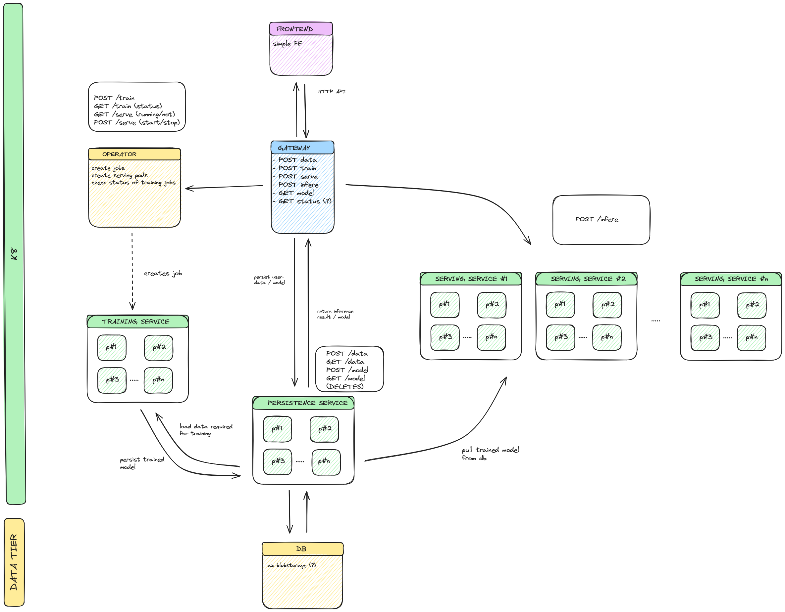

# ML as a Service

In the ever-changing, data-driven world we live in, new possibilities emerge every day, especially in the realm of research. While expert knowledge is often required to fully benefit from these opportunities, we aim to provide everyone interested in working with this data an easy-to-use, out-of-the-box model capable of leveraging provided data for classification and regression tasks. Specifically for the academic/education sector, users should be able to upload data and select a pre-defined model to get started and utilize basic computing power. Scaling, availability, and accessibility are provided by us, abstracting the technical components from the domain(-expert) user, allowing them to concentrate on gaining further insights into interesting topics.

## Value Proposition
Further details can be found in our [value proposition](https://docs.google.com/document/d/1FxX3pmvXWAWQ9-dPw1ywX_qll5r7SFyholCQi2ff00U/edit).

## Userexperience sketch
To complement the value proposition, we tried to illustrate the user experience through sketching, allowing for a better understanding of this product

## Architecture

## Roadmap
Work in progress

## Budget
Work in progress